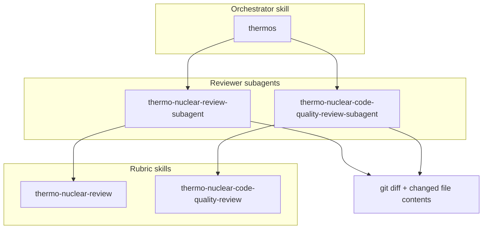

# thermos-claude

Thermo-nuclear branch review for **Claude Code** and **Codex**. This repo ports Cursor's [thermos](https://github.com/cursor/plugins/tree/main/thermos) plugin: a deep correctness and security audit plus a harsh code-quality rubric. Both run as parallel reviewer subagents, and their results merge into one verdict.

The skills and agents are a 1:1 port. A script derives every upstream file from a pinned upstream commit through a short list of mechanical rewrites, and CI fails if the committed files drift from that derivation. [docs/parity.diff](docs/parity.diff) shows every line the port changes.

## Install

### Claude Code

```text
/plugin marketplace add JackD111/thermos-claude
/plugin install thermos@thermos-claude
```

### Codex

```bash
codex plugin marketplace add JackD111/thermos-claude
```

```bash
codex plugin add thermos@thermos-claude
```

## Use

| Claude Code | Codex | What it does |
|:--|:--|:--|
| `/thermos:thermos` | `$thermos:thermos` | Runs both reviews in parallel on the current branch, then writes one deduplicated verdict. |
| `/thermos:thermo-nuclear-review` | `$thermos:thermo-nuclear-review` | Deep branch audit: bugs, breakages, security, devex, and feature-gate leaks. |
| `/thermos:thermo-nuclear-code-quality-review` | `$thermos:thermo-nuclear-code-quality-review` | Strict maintainability audit: code judo, the 1k-line rule, spaghetti, and boundaries. |

Give the review scope in the same message, for example `/thermos:thermos review this branch against main`. Both runtimes put the plugin name in front of each skill name. On Codex a bare `$thermos` does not resolve, because Codex hides a skill that it may not start on its own from the model's skill list.

`thermos` runs only when you invoke it, because a full review launches two subagents. The two rubric skills can also start when your request matches them.

## How it works



- **Claude Code.** `thermos` launches `thermos:thermo-nuclear-review-subagent` and `thermos:thermo-nuclear-code-quality-review-subagent` with the `Agent` tool, in one message, with `run_in_background: true`.
- **Codex.** Codex plugins cannot ship agent types. `thermos` tells Codex to read [its platform mapping](plugins/thermos/skills/thermos/references/codex-tools.md), so it calls `spawn_agent` twice in one response. Each child reads a copy of its reviewer agent that ships inside the skill. When subagents are unavailable, Codex runs the two reviews one after the other and says so.

## Differences from upstream

The full byte-level list is [docs/parity.diff](docs/parity.diff). In short:

- Cursor's `Task` tool, its `shell` and `explore` subagent types, and bare agent names become Claude Code's `Agent` tool, `Bash`, the built-in `Explore` agent, and `thermos:`-namespaced agents.
- The two rubric skills drop `disable-model-invocation: true`. Claude Code refuses to load a skill with that flag from inside a subagent, so with the flag the reviewers would fall back to a weak inline rubric.
- `thermos/SKILL.md` gains one line that points Codex to its platform mapping.

## Maintain the port

These commands need [Bun](https://bun.sh).

```bash
bun tools/sync.mjs --check
```

```bash
bun tools/generate.mjs --check
```

```bash
bun test
```

[CONTRIBUTING.md](CONTRIBUTING.md) covers upstream syncs, forks, and releases. [docs/design.md](docs/design.md) explains the design.

## License

MIT. The upstream work is Copyright (c) 2026 Cursor. See [LICENSE](LICENSE) and [NOTICE.md](NOTICE.md).
